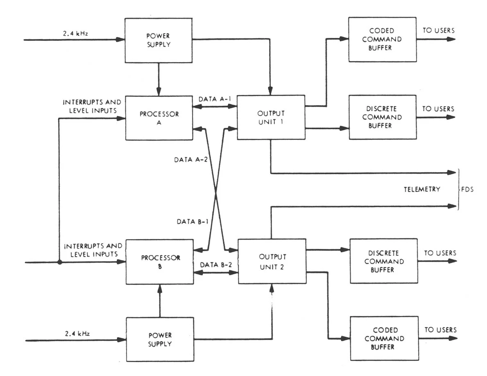

# Voyager-1 Computer

**By Sergio Rodriguez**

## Introduction

*The Voyager 1 mission represents one of humanity’s greatest engineering achievements. Originally designed for a 5-year mission, Voyager 1 has defied expectations, operating continuously for over 47 years. As of February 2025, it is 15.6 billion miles away, transmitting data from interstellar space. Its onboard computer systems have been running for 16,950 days, demonstrating an unparalleled level of reliability in deep space exploration.*

---

## The Computer

*The Voyager one computer system was a system of multiple computer systems that prioritized reliability. The computer systems consists of three computer systems, the CCS the FDS and the AACS with duable redudincy on each system. The onboard memory was all CMOS volatile memory and magetic tape memory meaning that the onboard computer had no hard coded read only memory onboard witch makes it unsual compared to todays standards. The computer system requires contonous power in order to prevent the entire the program from being erased. Double hardware redundincy allowes for more hardware reliability and operating in pure ram memory allowes for software developers to work around any deterioiting or broken parts in the computer system.*

// Change the abreviations

### Mission-Specific Design

- Built for longevity and low power consumption
- Designed for reliabily in its hardware design
- Radiation-hardened to withstand deep-space conditions

## Core Functions

Voyager 1 has three key onboard computer subsystems, each with a specific role in ensuring the success of the mission:

### Computer Command System (CCS)
*The CCS runs continuously, handling telecommands, telemetry, and coordinating with the FDS and AACS. It has 70kB of RAM and was inherited from the Viking missions due to budget constraints. As NASA's first double-redundant computer, its RAM-only design and cross-strapped power system ensured exceptional reliability. Both CCS units run simultaneously in three modes: individual (separate tasks), parallel (shared tasks), and tandem (critical operations like imaging, ensuring redundancy).
*
- Processes and executes commands sent from Earth
- Manages communication between different subsystems
- Stores and forwards scientific data

  

*Block diagram for Viking and Voyager CCS. Image courtesy of NASA.*

### Flight Data Subsystem (FDS)
*The FDS is a specialized computer that was designed for rapid data collection formating and transmission back to earth, the FDS is separate to the CCS because of its iherent rapid ouput bit rate. Much like the CCS the, program and telemetry data from sensors is stored in ram and any buffer overflow is stored on the onboard magnetic tape drive.*
- Collects and formats data from scientific instruments
- Compresses and encodes information for transmission to Earth
- Operates under strict power and memory constraints

### Attitude and Articulation Control Subsystem (AACS)
*The AACS was created off a modified CCS due to budgetary constraints; its main role is to keep the antenna pointed towards earth at all times using a combination of reaction wheels and thrusters. The AACS was the first of its kind to integrate a analog and digital computing elements in a new technology called HYSPACE. *
- Controls Voyager’s orientation in space
- Ensures the high-gain antenna remains pointed at Earth
- Uses gyroscopes and star trackers for navigation

---

### Comparison to Modern Computers
*When comparing modern computers to the voyager one omit the modern conviniences of screens, graphical interfaces, or even operatins systems all together because these are modern inventions designed for ease of use. When compared in this manner the Voyager-1 Computer is roughly 200,000 times slower than than the average modern computer with memory only half of the Texas Instruments Ti-84 Plus CE.*

#### The Operating System
*Almost all conventional computers have some sort of operating system (Windows, MacOS, Linux) an operating system simply allowes for one machine to run and switch between tens if not thaousands of programs at the time. The Voyager-1 Computer system did not have an operating system and was interrupt driven in terms if OS design. This means that instead of timesharing programs on the computer, the computer sits idle (or stops its current task) until an interrupt kickstarts the machine to do some program. The lack of an operating system is unique in the sense that it cut down on complexity and increased reliability because the computer*
- **Processing Power:** Voyager’s computers operate at a fraction of the speed of modern microprocessors.
- **Storage:** Uses a few kilobytes of memory compared to gigabytes or terabytes today.
- **Programming:** Runs programs stored in its working memory, there is no permanent program storage.

> "add some quote"
---

## Challenges of Deep Space Computing

### Keeping the Onboard Computer Running
- Limited power supply from **Radioisotope Thermoelectric Generators (RTGs)**, which lose ~4W per year.
- Extreme conditions: Voyager 1 operates in a near-absolute zero temperature environment.
- Radiation exposure and cosmic ray interference affecting memory storage.

## The Last Software Update
- A recent update was sent to **work around damaged memory**, allowing the spacecraft to continue transmitting data.
- Engineers devised a solution despite having no real-time access to the hardware.
- Showcases the ingenuity required for long-term deep-space missions.

---

## Conclusion

Voyager 1’s computer system stands as a testament to the brilliance of its designers. The mission highlights the importance of **reliability over raw power** in space exploration and serves as an inspiration for future deep-space missions. As the spacecraft continues drifting through interstellar space, it carries with it a message from humanity—both in the form of the **Golden Record** and in its enduring technological legacy.

---

## Associated Code Project

The magazine article will be accompanied by a **code project** aimed at emulating aspects of the **Flight Data Subsystem (FDS)** and **Command and Data Subsystem (CCS)**. This project will provide insight into how Voyager’s computers process and transmit data across billions of miles.

---

## Preliminary Bibliography

### Nasa Article
[Nasa Article](https://nssdc.gsfc.nasa.gov/nmc/spacecraft/display.action?id=1977-084A) 

### Stats on Sensors  
[Voyager Imaging Science Subsystem](https://pds-ppi.igpp.ucla.edu/mission/Voyager/Imaging_Science_Subsystem_-_Wide_Angle)

### CCSDS Packet Standards  
[CCSDS Official Standards](https://public.ccsds.org/Pubs/133x0b2e2.pdf)  
[CCSDS Python Implementation](https://docs.ccsdspy.org/en/latest/user-guide/ccsds.html)

### Other Sources  
[Voyager Mission and Onboard Computers](https://www.allaboutcircuits.com/news/voyager-mission-anniversary-computers-command-data-attitude-control/)

Sergio Rodriguez
Digital Media Project Outline
The Voyager One Computer
Introduction
- Brief Introduction on the Voyager one Mission and the significance of the longevity of the onboard system; include its relevance today.
The Computer
- Overview of the onboard computer for the layman, mission specific design compared to modern computer architecture and computers of the time.
Core functions
- Talk about the CCS, FDS, and AACS core computer functions.
Challenges of Deep Space Computing
- Brief overview on the challenges of keeping the onboard computer running and focus on the last update sent meant to circumvent damaged memory.
Conclusion
- The ‘so what’ of deep space computing and appreciation of the voyager one computer mission.
Include the associated code project for FDS and CCS emulation. Very possible the magazine article will be written and formatted in markdown in the README.md
