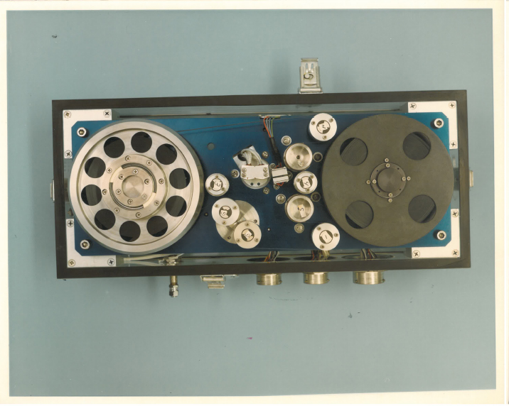
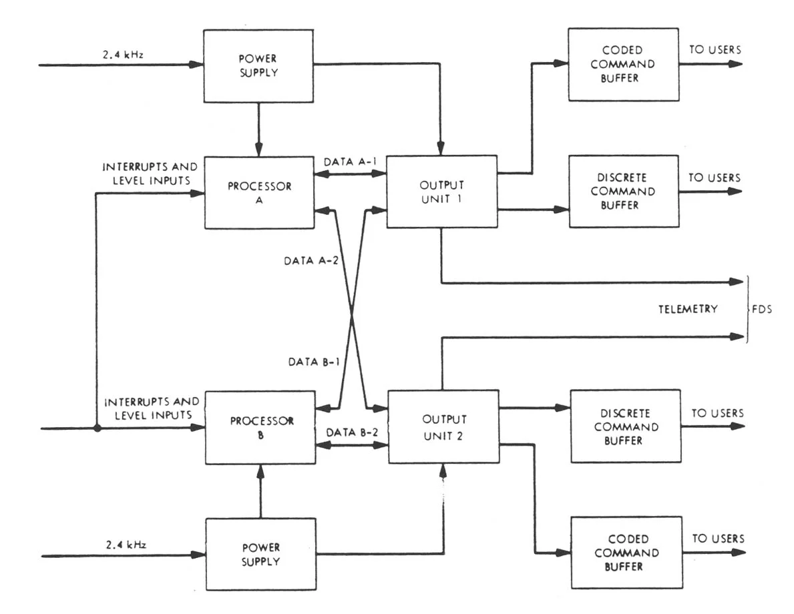
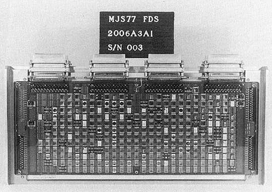
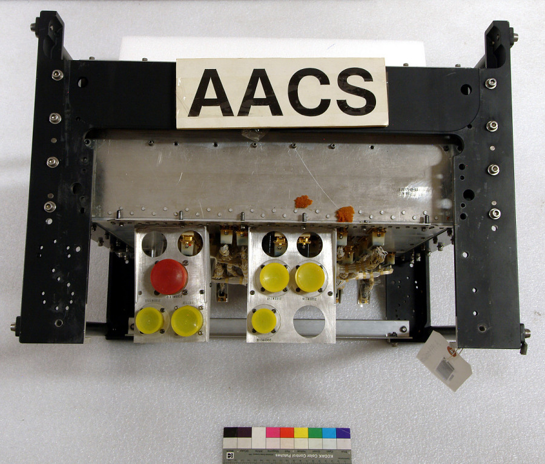

# Voyager-1's Computer: Ensuring Survival Beyond the Solar System

**By Sergio Rodriguez**

  

<em>Voyager's 8-track digital tape recorder. NASA/JPL-Caltech</em>

## Introduction

*The Voyager 1 mission represents one of humanity’s greatest engineering achievements. Originally designed for a five-year mission, Voyager 1 has defied expectations, operating continuously for over 47 years. As of February 2025, it is 15.6 billion miles away, transmitting data from interstellar space. Its onboard computer systems have been running for 16,950 days, demonstrating an unparalleled level of reliability in deep space exploration.*

---

## The Computer

*The Voyager 1 computer system consisted of multiple computer subsystems designed for reliability. These systems include three primary subsystems: the Command and Control System (CCS), the Flight Data Subsystem (FDS), and the Attitude and Articulation Control Subsystem (AACS), each with dual redundancy. The onboard memory comprises CMOS volatile memory and magnetic tape storage, meaning that the spacecraft has no hardcoded read-only memory, which is unusual by today’s standards. The system requires continuous power to prevent the loss of its entire program. Double hardware redundancy increases reliability, and the RAM-only design allows software developers to work around deteriorating or broken components in the computer system.*

### Mission-Specific Design

- Built for longevity and low power consumption
- Designed for reliability in its hardware architecture
- Radiation-hardened to withstand deep-space conditions

## Core Functions

Voyager 1 has three key onboard computer subsystems, each playing a crucial role in ensuring mission success:

### Command and Control System (CCS)

*The CCS runs continuously, handling telecommands, telemetry, and coordinating with the FDS and AACS. It has 70 KB of RAM and was inherited from the Viking missions due to budget constraints. As NASA’s first double-redundant computer, its RAM-only design and cross-strapped power system ensured exceptional reliability. Both CCS units run simultaneously in three modes: individual (separate tasks), parallel (shared tasks), and tandem (critical operations like imaging, ensuring redundancy).*

- Processes and executes commands sent from Earth
- Manages communication between different subsystems
- Stores and forwards scientific data

  

*Block diagram for Viking and Voyager CCS. Image courtesy of NASA.*

### Flight Data Subsystem (FDS)

*The FDS is a specialized computer designed for rapid data collection, formatting, and transmission back to Earth. It operates separately from the CCS due to its inherently high output bit rate. Like the CCS, program and telemetry data from sensors are stored in RAM, with buffer overflow data saved on the onboard magnetic tape drive.*

- Collects and formats data from scientific instruments
- Compresses and encodes information for transmission to Earth
- Operates under strict power and memory constraints

  

*Voyager’s flight data subsystem (FDS). Image courtesy of NASA.*

### Attitude and Articulation Control Subsystem (AACS)

*The AACS was developed as a modified version of the CCS due to budgetary constraints. Its primary role is to keep the antenna pointed towards Earth at all times using a combination of reaction wheels and thrusters. The AACS was the first of its kind to integrate both analog and digital computing elements in a new technology called HYSPACE.*

- Controls Voyager’s orientation in space
- Ensures the high-gain antenna remains pointed at Earth
- Uses gyroscopes and star trackers for navigation

  

*Image of the AACS. Transferred from NASA, Jet Propulsion Laboratory*

---

### Comparison to Modern Computers

*When comparing Voyager 1’s computer to modern systems, one must omit conveniences like screens, graphical interfaces, or even operating systems, as these are relatively modern innovations designed for usability. In raw performance terms, the Voyager 1 computer is approximately 200,000 times slower than an average modern computer and has memory capacity only half that of a Texas Instruments Ti-84 Plus CE calculator.*

#### The Operating System

*Unlike conventional computers, which run operating systems such as Windows, macOS, or Linux, Voyager 1 does not have an operating system. Instead, it is interrupt-driven. This means that rather than timesharing programs, the computer remains idle or halts its current task until an interrupt triggers execution. The absence of an operating system reduces complexity and increases reliability by allocating fewer resources to OS management.*

- **Processing Power:** Voyager’s computers operate at a fraction of the speed of modern microprocessors.
- **Storage:** Uses only a few kilobytes of memory compared to gigabytes or terabytes today.
- **Programming:** Runs programs stored in working memory, with no permanent program storage.

> "Add some quote."

---

## Challenges of Deep Space Computing

### Keeping the Onboard Computer Running

*The Voyager 1 computer has faced multiple challenges throughout its 47-year voyage. Beyond surviving the vibrations of launch, the extreme temperature fluctuations of space, and the vacuum of interstellar travel, the computer must continuously contend with radiation. Cosmic rays and charged particles can damage components and induce soft errors, such as bit flips, altering the onboard program during flight. Additionally, the spacecraft’s **radioisotope thermoelectric generator (RTG)** loses power each year, requiring software adjustments to maintain functionality.*

- Limited power supply from **RTGs**, which lose ~4W per year
- Extreme conditions: Voyager 1 operates in a near-absolute zero temperature environment
- Radiation exposure and cosmic ray interference affecting memory storage

## The Last Software Update

*In November 2023, Voyager 1 began transmitting corrupted data due to a malfunctioning chip in the FDS subsystem. This is where the RAM-only architecture proved invaluable—engineers on Earth were able to upload a software update that circumvented the faulty chip, enabling continued operation. In April 2024, Voyager 1 resumed sending data to Earth. Current efforts focus on synchronizing the magnetic tape drive with the rest of the system. This showcases the foresight, simplicity, and reliability of Voyager’s design, proving that a spacecraft 15 billion miles away can still be maintained through software updates.*

- A recent update **worked around damaged memory**, allowing the spacecraft to continue transmitting data.
- Engineers devised a solution despite having no real-time access to the hardware.
- Highlights the ingenuity required for long-term deep-space missions.

---

## Conclusion

The Voyager-1 computer system is a testament to the ingenuity and foresight of its designers. Its architecture prioritizes reliability, adaptability, and longevity—qualities that have allowed it to remain the farthest continuously operating machine humanity has ever created. The onboard computer has expanded our understanding of the solar system and stands as a lasting reminder that wherever Voyager-1 travels, it carries proof that humanity once existed and reached for the stars.

---

## Associated Code Project

code docs

---
## Works Cited

**Chang, Kenneth.** "NASA Has Fixed Voyager 1, the Most Distant Spacecraft." *The New York Times*,  
15 June 2024, https://www.nytimes.com/2024/06/15/science/space/nasa-voyager-one-fixed.html.  

**NASA.** "Voyager 1 Spacecraft Details." *NASA National Space Science Data Center*,  
https://nssdc.gsfc.nasa.gov/nmc/spacecraft/display.action?id=1977-084A.  

**NASA.** "Voyager Imaging Science Subsystem - Wide Angle." *NASA Planetary Data System*,  
https://pds-ppi.igpp.ucla.edu/mission/Voyager/Imaging_Science_Subsystem_-_Wide_Angle.  

**Consultative Committee for Space Data Systems (CCSDS).** *CCSDS Packet Standards.*  
https://public.ccsds.org/Pubs/133x0b2e2.pdf.  

**CCSDS.** "CCSDS Python Implementation." *CCSDS Documentation*,  
https://docs.ccsdspy.org/en/latest/user-guide/ccsds.html.  

**All About Circuits.** "Voyager Mission Anniversary: Computers, Command, Data, and Attitude Control."  
https://www.allaboutcircuits.com/news/voyager-mission-anniversary-computers-command-data-attitude-control/.  

**Analog Devices.** "Challenges for Electronic Circuits in Space Applications." *Analog Devices Signals & Systems*,  
https://www.analog.com/en/signals/thought-leadership/challenges-for-electronic-circuits-in-space-applications.html.  

**Horgan, John.** "Vintage Voyager Probes: The Lasting Legacy of NASA's Space Explorers." *Wired*,  
https://www.wired.com/2013/09/vintage-voyager-probes/.  
