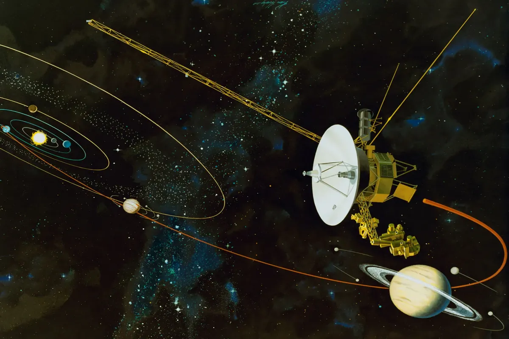

# Voyager-1's Computer: Ensuring Survival Beyond the Solar System

**By Sergio Rodriguez**

  

<em>Voyager's 8-track digital tape recorder. NASA/JPL-Caltech</em>

## Introduction

*The Voyager 1 mission represents one of humanity’s greatest engineering achievements. Originally designed for a five-year mission, Voyager 1 has defied expectations, operating continuously for over 47 years. As of February 2025, it is 15.6 billion miles away, transmitting data from interstellar space. Its onboard computer systems have been running for 16,950 days, demonstrating an unparalleled level of reliability in deep space exploration.*

---

## The Computer

*The Voyager 1 computer system consisted of multiple computer subsystems designed for reliability. These systems include three primary subsystems: the Command and Control System (CCS), the Flight Data Subsystem (FDS), and the Attitude and Articulation Control Subsystem (AACS), each with dual redundancy. The onboard memory comprises CMOS volatile memory and magnetic tape storage, meaning that the spacecraft has no hardcoded read-only memory, which is unusual by today’s standards. The system requires continuous power to prevent the loss of its entire program. Double hardware redundancy increases reliability, and the RAM-only design allows software developers to work around deteriorating or broken components in the computer system.*

### Mission-Specific Design

- Built for longevity and low power consumption
- Designed for reliability in its hardware architecture
- Radiation-hardened to withstand deep-space conditions

## Core Functions

Voyager 1 has three key onboard computer subsystems, each playing a crucial role in ensuring mission success:

### Command and Control System (CCS)

*The CCS runs continuously, handling telecommands, telemetry, and coordinating with the FDS and AACS. It has 70 KB of RAM and was inherited from the Viking missions due to budget constraints. As NASA’s first double-redundant computer, its RAM-only design and cross-strapped power system ensured exceptional reliability. Both CCS units run simultaneously in three modes: individual (separate tasks), parallel (shared tasks), and tandem (critical operations like imaging, ensuring redundancy).*

- Processes and executes commands sent from Earth
- Manages communication between different subsystems
- Stores and forwards scientific data

  

*Block diagram for Viking and Voyager CCS. Image courtesy of NASA.*

### Flight Data Subsystem (FDS)

*The FDS is a specialized computer designed for rapid data collection, formatting, and transmission back to Earth. It operates separately from the CCS due to its inherently high output bit rate. Like the CCS, program and telemetry data from sensors are stored in RAM, with buffer overflow data saved on the onboard magnetic tape drive.*

- Collects and formats data from scientific instruments
- Compresses and encodes information for transmission to Earth
- Operates under strict power and memory constraints

  

*Voyager’s flight data subsystem (FDS). Image courtesy of NASA.*

### Attitude and Articulation Control Subsystem (AACS)

*The AACS was developed as a modified version of the CCS due to budgetary constraints. Its primary role is to keep the antenna pointed towards Earth at all times using a combination of reaction wheels and thrusters. The AACS was the first of its kind to integrate both analog and digital computing elements in a new technology called HYSPACE.*

- Controls Voyager’s orientation in space
- Ensures the high-gain antenna remains pointed at Earth
- Uses gyroscopes and star trackers for navigation

  

*Image of the AACS. Transferred from NASA, Jet Propulsion Laboratory*

---

### Comparison to Modern Computers

*When comparing Voyager 1’s computer to modern systems, one must omit conveniences like screens, graphical interfaces, or even operating systems, as these are relatively modern innovations designed for usability. In raw performance terms, the Voyager 1 computer is approximately 200,000 times slower than an average modern computer and has memory capacity only half that of a Texas Instruments Ti-84 Plus CE calculator.*

#### The Operating System

*Unlike conventional computers, which run operating systems such as Windows, macOS, or Linux, Voyager 1 does not have an operating system. Instead, it is interrupt-driven. This means that rather than timesharing programs, the computer remains idle or halts its current task until an interrupt triggers execution. The absence of an operating system reduces complexity and increases reliability by allocating fewer resources to OS management.*

- **Processing Power:** Voyager’s computers operate at a fraction of the speed of modern microprocessors.
- **Storage:** Uses only a few kilobytes of memory compared to gigabytes or terabytes today.
- **Programming:** Runs programs stored in working memory, with no permanent program storage.

---

## Challenges of Deep Space Computing

### Keeping the Onboard Computer Running

*The Voyager 1 computer has faced multiple challenges throughout its 47-year voyage. Beyond surviving the vibrations of launch, the extreme temperature fluctuations of space, and the vacuum of interstellar travel, the computer must continuously contend with radiation. Cosmic rays and charged particles can damage components and induce soft errors, such as bit flips, altering the onboard program during flight. Additionally, the spacecraft’s **radioisotope thermoelectric generator (RTG)** loses power each year, requiring software adjustments to maintain functionality.*

- Limited power supply from **RTGs**, which lose ~4W per year
- Extreme conditions: Voyager 1 operates in a near-absolute zero temperature environment
- Radiation exposure and cosmic ray interference affecting memory storage

## The Last Software Update

*In November 2023, Voyager 1 began transmitting corrupted data due to a malfunctioning chip in the FDS subsystem. This is where the RAM-only architecture proved invaluable—engineers on Earth were able to upload a software update that circumvented the faulty chip, enabling continued operation. In April 2024, Voyager 1 resumed sending data to Earth. Current efforts focus on synchronizing the magnetic tape drive with the rest of the system. This showcases the foresight, simplicity, and reliability of Voyager’s design, proving that a spacecraft 15 billion miles away can still be maintained through software updates.*

- A recent update **worked around damaged memory**, allowing the spacecraft to continue transmitting data.
- Engineers devised a solution despite having no real-time access to the hardware.
- Highlights the ingenuity required for long-term deep-space missions.

---

## Conclusion

The Voyager-1 computer system is a testament to the ingenuity and foresight of its designers. Its architecture prioritizes reliability, adaptability, and longevity—qualities that have allowed it to remain the farthest continuously operating machine humanity has ever created. The onboard computer has expanded our understanding of the solar system and stands as a lasting reminder that wherever Voyager-1 travels, it carries proof that humanity once existed and reached for the stars.

  

---

## Associated Code Project

# CCSDS Packet Handling for ESP32 Camera

This project demonstrates how to capture images using the Xiao ESP32S3 camera module, wrap the captured image into a CCSDS (Consultative Committee for Space Data Systems) packet, and transmit it using serial communication. This is useful for telemetry or telecommand systems, especially in space-related applications that rely on CCSDS as a data format.

The project draws inspiration from space missions like **Voyager 1**, which has been transmitting data back to Earth using the CCSDS packet format for decades. Just as Voyager 1 continues to send telemetry and scientific data across vast distances, this project mimics the same principles of packetizing data for transmission over serial communication.

## Table of Contents

- [Overview](#overview)
- [Hardware Requirements](#hardware-requirements)
- [Software Requirements](#software-requirements)
- [File Structure](#file-structure)
- [CCSDS Packet Format](#ccsds-packet-format)
- [Code Description](#code-description)
  - [CCSDS Header Structure](#ccsds-header-structure)
  - [Setup Function](#setup-function)
  - [Image Capture and Packet Creation](#image-capture-and-packet-creation)
  - [CCSDS Parser](#ccsds-parser)
- [Usage](#usage)

## Overview

This project captures images from the Xiao ESP32S3 camera module and packages them into a CCSDS packet format, which includes a primary header with metadata on the type of data being packaged such as telemetry, instrument type, and packet length. There is an optional secondary header containing additional metadata such as a timestamp. The primary header, secondary header, and data are wrapped into one packet and sent over serial.

This project is inspired by the data transmission methods used in **Voyager 1**. Similarly, this project was written in **C/C++** to mimic the low-level programming necessary for operating the onboard computers.

## Hardware Requirements

- Xiao ESP32S3 camera module (or compatible ESP32 camera module)
- Serial Monitor for debugging

## Software Requirements

- ESP32 Camera library (`esp_camera.h`)

## File Structure

- `CCSDS_header.h`: Defines the CCSDS packet structure, including the primary and secondary headers.
- `CCSDS_Parser.cpp`: Provides methods to parse and print CCSDS packets.
- `camera_pins.h`: Contains the camera-specific pin configuration.
- `main.cpp`: The main ESP32 program that sets up the camera, captures images, and creates CCSDS packets.

## CCSDS Packet Format

A CCSDS packet consists of:

1. **Primary Header**: Includes essential metadata, such as version, packet length, sequence count, and APID.
2. **Secondary Header** (optional): Currently defined but not yet implemented, it may contain additional metadata.
3. **Payload**: The actual data or content being transmitted (e.g., an image).

The packet is packed with `#pragma pack(push, 1)` to ensure no padding and proper memory alignment.

### Primary Header Fields:
- `version`: 3-bit version of the packet.
- `type`: 1-bit type (telemetry or telecommand).
- `secondary_header`: 1-bit flag to indicate if a secondary header is included.
- `apid`: 11-bit Application Process Identifier.
- `sequence_flags`: 2-bit flags indicating sequence information.
- `sequence_count`: 14-bit sequence number.
- `packet_length`: 16-bit length of the data payload.

### Secondary Header (Optional):
- `timestamp`: 32-bit timestamp (not yet implemented).
- `data_id`: 16-bit identifier for the data type.

### Payload:
- Variable-length data, depending on the image size.

## Code Description

### CCSDS Header Structure

The `CCSDS_header.h` file defines the structure of the CCSDS packet, including the primary header, the optional secondary header, and the data payload.

### Setup Function

In the `setup()` function:
- Serial communication is initialized at a baud rate of 115200.
- The camera is configured and initialized using the `esp_camera_init()` function.
- If the camera initialization fails, an error is printed via serial.

### Image Capture and Packet Creation

- The `loop()` function captures images every 5 seconds using the camera.
- The captured image is wrapped in a CCSDS packet using the `createImagePacket()` function.
- The packet is serialized and transmitted via serial using a custom start word (`0xAA 0xBB 0xCC`).
- The packet includes the primary header, and the image is embedded in the payload.

### CCSDS Parser

The `CCSDS_Parser` class is responsible for parsing the CCSDS packet:
- The `parseCCSDS()` method extracts the primary header and payload from a raw byte buffer.
- The `printCCSDS()` method prints the packet's details (primary header and payload) in a human-readable format for debugging.

## Usage

1. **Install dependencies**:
   - Install the `esp_camera` library for ESP32.
   
2. **Upload the code** to your ESP32 using the Arduino IDE.
   
3. **Open the Serial Monitor** to view the captured images in the form of CCSDS packets.
   
4. **Monitor Image Packets**:
   - Each captured image will be wrapped in a CCSDS packet and sent via serial.
   - The packet details (including primary header and payload) will be printed to the serial monitor.

5. **CCSDS Packet Details**:
   - The serial monitor will display the packet's version, APID, sequence count, and packet length.
   - If the payload option is enabled, the image data will be printed in hexadecimal format.

## Why Low-Level Programming Was Important

### Memory Management:
Low-level programming is crucial in resource-constrained environments like the ESP32. This microcontroller has limited memory, and controlling memory allocation directly is essential for efficient operation. By using **manual memory management** (e.g., `malloc()` and `free()`), this system mimics the resource-conscious programming required for space applications. Space missions like **Voyager 1** face extreme resource constraints, where every byte of memory and every instruction must be optimized to avoid waste and ensure successful data transmission. The low-level approach in this project allows for tight control over memory usage, which is essential when dealing with limited resources, similar to Voyager 1's onboard systems.

### Efficient Data Packing:
The CCSDS packet format demands precise control over the packing of data, as even small inefficiencies can have significant impacts on data integrity and transmission reliability. Low-level programming allows us to manually pack the headers and payload to ensure there is no unnecessary padding or alignment issues. This is particularly critical for space systems like **Voyager 1**, where every byte of data must be packed efficiently for long-distance transmission.

### Data Transmission:
Just as Voyager 1 uses **low-level protocols** to send data back to Earth, this project implements low-level serial communication to transmit the CCSDS packets. This ensures efficient, error-free data transmission that mimics the kind of communication used in space missions. Low-level control of serial transmission allows for the manual handling of byte streams, ensuring that data is sent correctly, and critical information, like image data, is preserved without corruption.

## Future Improvements

- Implement the secondary header for additional metadata, such as timestamp or other identifiers.
- Create a micro-kernel for recieving telecommand data. 

---
## Works Cited

**Chang, Kenneth.** "NASA Has Fixed Voyager 1, the Most Distant Spacecraft."  
*The New York Times*, 15 June 2024,  
[https://www.nytimes.com/2024/06/15/science/space/nasa-voyager-one-fixed.html](https://www.nytimes.com/2024/06/15/science/space/nasa-voyager-one-fixed.html).  

**NASA.** "Voyager 1 Spacecraft Details."  
*NASA National Space Science Data Center*,  
[https://nssdc.gsfc.nasa.gov/nmc/spacecraft/display.action?id=1977-084A](https://nssdc.gsfc.nasa.gov/nmc/spacecraft/display.action?id=1977-084A).  

**NASA.** "Voyager Imaging Science Subsystem - Wide Angle."  
*NASA Planetary Data System*,  
[https://pds-ppi.igpp.ucla.edu/mission/Voyager/Imaging_Science_Subsystem_-_Wide_Angle](https://pds-ppi.igpp.ucla.edu/mission/Voyager/Imaging_Science_Subsystem_-_Wide_Angle).  

**Consultative Committee for Space Data Systems (CCSDS).** *CCSDS Packet Standards.*  
[https://public.ccsds.org/Pubs/133x0b2e2.pdf](https://public.ccsds.org/Pubs/133x0b2e2.pdf).  

**CCSDS.** "CCSDS Python Implementation."  
*CCSDS Documentation*,  
[https://docs.ccsdspy.org/en/latest/user-guide/ccsds.html](https://docs.ccsdspy.org/en/latest/user-guide/ccsds.html).  

**All About Circuits.** "Voyager Mission Anniversary: Computers, Command, Data, and Attitude Control."  
[https://www.allaboutcircuits.com/news/voyager-mission-anniversary-computers-command-data-attitude-control/](https://www.allaboutcircuits.com/news/voyager-mission-anniversary-computers-command-data-attitude-control/).  

**Analog Devices.** "Challenges for Electronic Circuits in Space Applications."  
*Analog Devices Signals & Systems*,  
[https://www.analog.com/en/signals/thought-leadership/challenges-for-electronic-circuits-in-space-applications.html](https://www.analog.com/en/signals/thought-leadership/challenges-for-electronic-circuits-in-space-applications.html).  

**Horgan, John.** "Vintage Voyager Probes: The Lasting Legacy of NASA's Space Explorers."  
*Wired*,  
[https://www.wired.com/2013/09/vintage-voyager-probes/](https://www.wired.com/2013/09/vintage-voyager-probes/).  

**Limeng Du.** "SeeedStudio XIAO ESP32S3 Sense Camera - Take Photos Example."  
*GitHub Repository*,  
[https://github.com/limengdu/SeeedStudio-XIAO-ESP32S3-Sense-camera/blob/main/take_photos/take_photos.ino](https://github.com/limengdu/SeeedStudio-XIAO-ESP32S3-Sense-camera/blob/main/take_photos/take_photos.ino).  
